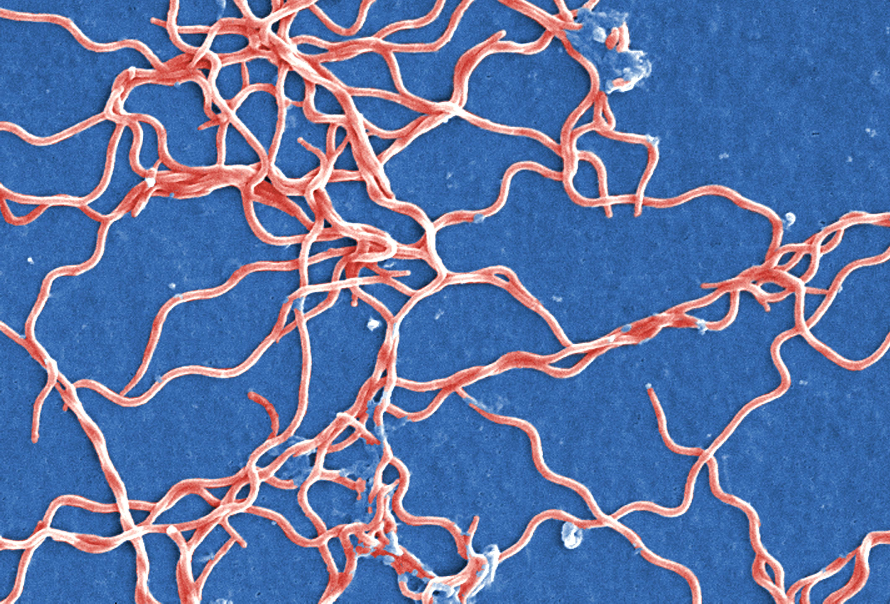

Read in CSV file 
```{r}
#library(Biostrings)

Seqs<-read.csv("Sequences.csv")

colnames(Seqs) <- c("Sequence Name", "Bases")
```

Remove anything but the base pairs for the sequences, and store them.
```{r}
Seq1<-gsub("[^ATCG]","", Seqs$Bases[1])
####Seq1string<-DNAString(Seq1)
Seq2<-gsub("[^ATCG]","", Seqs$Bases[2])
Seq3<-gsub("[^ATCG]","", Seqs$Bases[3])
```

#Count number of bases for each sequence

```{r}
Seq1split <-strsplit(Seq1, "")[[1]]
Seq2split <-strsplit(Seq2,"")[[1]]
Seq3split <-strsplit(Seq3,"")[[1]]

print(Seq1split)
length(Seq1split)
print(Seq2split)
length(Seq2split)
print(Seq3split)
length(Seq3split)
```
##ATCG content HQ433692.1
```{r}
#counting per basepair for sequence 1
Seq1.A <- sum(grepl("A", Seq1split))
Seq1.T <- sum(grepl("T", Seq1split))
Seq1.C <- sum(grepl("C", Seq1split))
Seq1.G <- sum(grepl("G", Seq1split))
```
##ATCG content HQ433694.1
```{r}
Seq2.A <- sum(grepl("A", Seq2split))
Seq2.T <- sum(grepl("T", Seq2split))
Seq2.C <- sum(grepl("C", Seq2split))
Seq2.G <- sum(grepl("G", Seq2split))
```
##ATCG content HQ422691.1
```{r}
Seq3.A <- sum(grepl("A", Seq3split))
Seq3.T <- sum(grepl("T", Seq3split))
Seq3.C <- sum(grepl("C", Seq3split))
Seq3.G <- sum(grepl("G", Seq3split))
```
Make a table with the ATCG values

Nucleotide Content
------------------

Seq Names | A | C | G | T|
---------|----------|---------|----------|-------|
HQ433692.1|155    | 82       |   131 | 114 |
HQ433694.1| 156 | 82 | 131 | 114|
HQ433691.1| 155 | 82 | 132 | 115|



[I heard you also wanted a link to Borrelia burgdorferi](https://en.wikipedia.org/wiki/Borrelia_burgdorferi)

#Calculate GC content for each sequence
##GC content for HQ433692.1
```{r}
(Seq1.C+Seq1.G)/(Seq1.A+Seq1.C+Seq1.G+Seq1.T)
#44.19%
```
##GC content for HQ433694.1
```{r}
(Seq2.C+Seq2.G)/(Seq2.A+Seq2.C+Seq2.G+Seq2.T)
#44.10%
```
##GC content for HQ433691.1
```{r}
(Seq3.C+Seq3.G)/(Seq3.A+Seq3.C+Seq3.G+Seq3.T)
#44.10%
```

GC Content
---------------

Seq Names/ID | GC% |
--------|------|
HQ433692.1 | 44.19%
HQ433694.1 | 44.10%
HQ433691.1 | 44.10%
